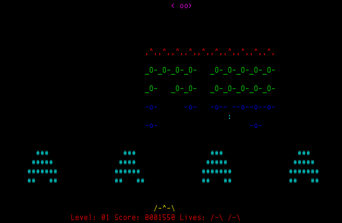

===========
*nInvaders*
===========

A Space Invaders clone in C with ncurses, see the original |README|_ for more information.

.. |README| replace:: ``README``
.. _README: README

.. contents:: **Contents**
   :local:

History
=======

nInvaders was statred in 2002 (according to copyright year) by Thomas Dettbarn, and later Mike Saarna, Alexander Hollinger, Sebastian Gutsfeld, and Matthias Thar had contributed. However, the development ceased in October, 2003.

In January, 2016, `Grandpa's Code`_ attempted to continue, and it's been updated to gnu99.

.. _Grandpa's Code: https://bitbucket.org/grandpas/code

Copyright
=========

This game is licensed under the GPLv2, see |LICENSE|_.

.. |LICENSE| replace:: ``LICENSE``
.. _LICENSE: LICENSE
